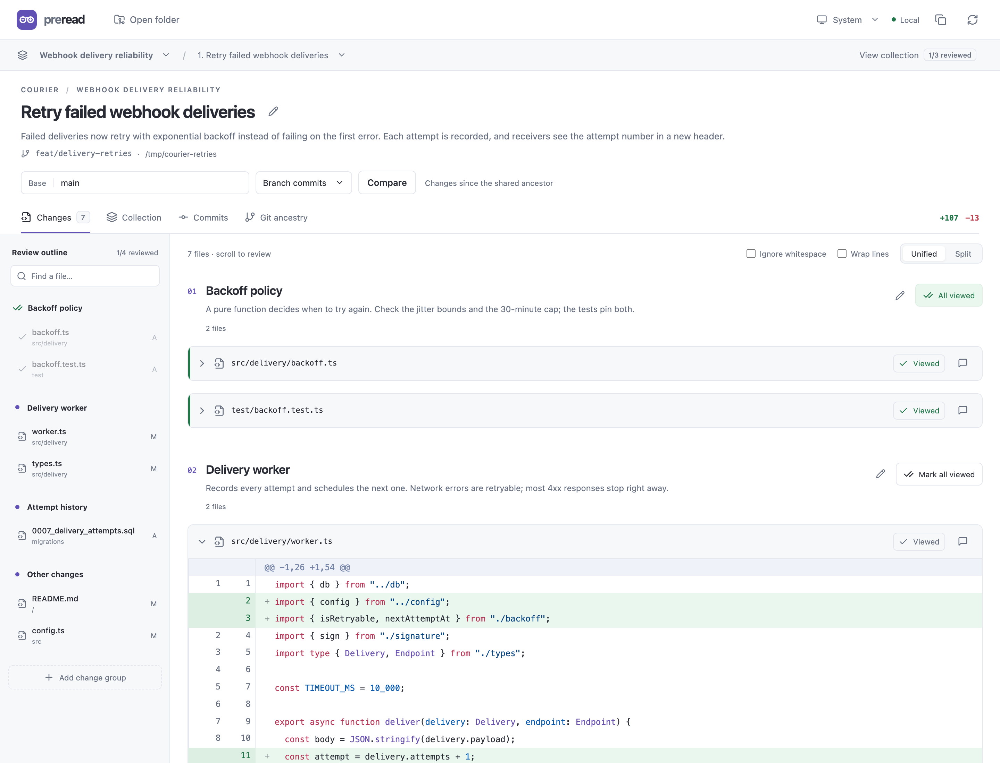
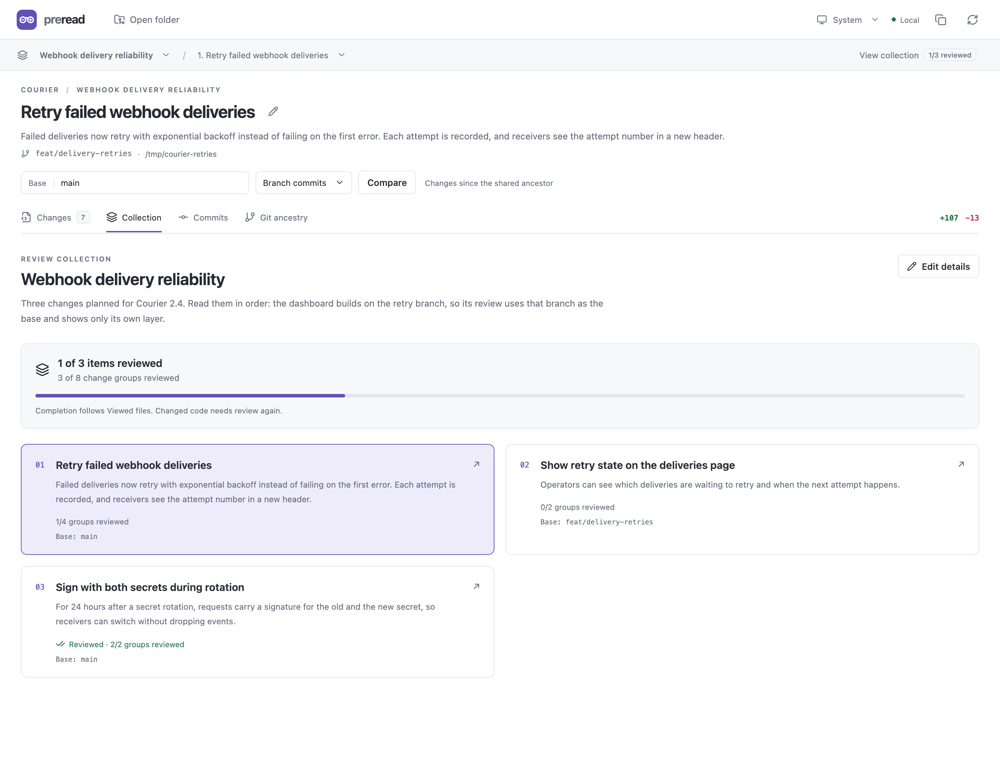
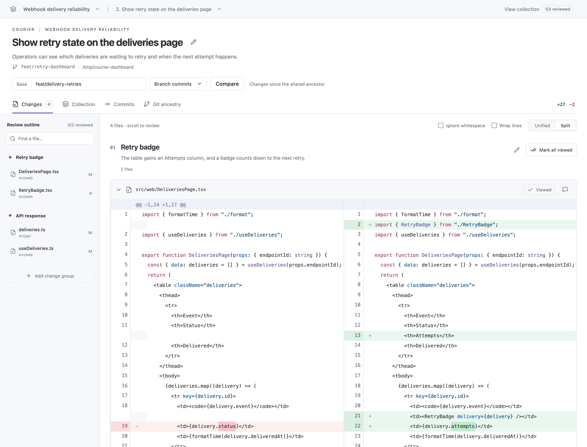

# Worktree review

Read what your coding agents wrote, on your own machine, before any of it becomes a pull request.

<picture>
  <source media="(prefers-color-scheme: dark)" srcset="docs/screenshots/review-dark.png">
  
</picture>

Agents that work in parallel leave you with a pile of worktrees and branches to read. Worktree review lets the agent hand you a reading list instead: a collection of reviews, each pointing at a worktree and the base to compare it with, and each diff split into change groups that say what changed and why. You read in the browser and mark files Viewed as you go. The app keeps track of what you've finished and reopens anything that changes after you read it.

It only reads Git. It never checks out, stages, commits, fetches, or pushes, and it runs on your machine. Its only network calls are optional pull request status reads through the GitHub CLI.

## What you get

- **Collections.** Related changes in one reading list, even across worktrees and repositories. Each review has its own base, so a stacked branch shows only its own layer.
- **Change groups.** Files, or individual hunks, grouped under a title and a description of the decision. Anything left unassigned appears under Other changes, so nothing is hidden.
- **Progress that follows the code.** A group is reviewed once every file in it is Viewed. When a file's diff changes, its mark clears and the group reopens.
- **Four comparisons.** Branch commits, branch plus local edits (including untracked files), uncommitted changes, and staged changes.
- **A diff reader built for long reads.** Unified or split view, syntax highlighting, line wrapping, ignore whitespace, context that expands 20 lines at a time, before-and-after previews of changed images, and private notes on any file.
- **Pull request status.** Link a review to a GitHub pull request to see its state, checks, and review decision, and whether your local head and base still match it.
- **Light and dark themes.** It follows your system setting by default.

<picture>
  <source media="(prefers-color-scheme: dark)" srcset="docs/screenshots/collection-dark.png">
  
</picture>

## Requirements

- Node.js 22.13 or later
- pnpm 11
- Git 2.36 or later
- Optional: the [GitHub CLI](https://cli.github.com), signed in, for pull request status

Developed on macOS; the tests also run on Linux. Windows isn't supported.

## Quick start

```sh
git clone https://github.com/joshmatz/worktree-review.git
cd worktree-review
pnpm install
pnpm build
pnpm start
```

Open <http://127.0.0.1:4780>, choose **Open folder**, and enter the absolute path of a repository or worktree. You can also pass an absolute path at startup with `pnpm start /path/to/worktree`.

That opens an ad hoc comparison. Pick a base and a mode, then **Save a named review** to keep it. The app is most useful with collections, which you or your agent write as a manifest.

## Collections

A collection is a JSON manifest. Import it with the CLI, which prints a link to the first review:

```sh
pnpm collection import /absolute/path/to/manifest.json
pnpm collection list
pnpm collection show <collection-id>
```

Open any review directly at `http://127.0.0.1:4780/?collection=<collection-id>&review=<review-id>`.

```json
{
  "id": "webhook-reliability",
  "title": "Webhook delivery reliability",
  "description": "Three changes planned for the next release. Read them in order.",
  "reviews": [
    {
      "id": "delivery-retries",
      "title": "Retry failed webhook deliveries",
      "description": "Failed deliveries now retry with exponential backoff instead of failing on the first error.",
      "path": "/Users/you/src/courier-retries",
      "base": "main",
      "mode": "branch",
      "pullRequest": "https://github.com/owner/repo/pull/142",
      "groups": [
        {
          "id": "backoff-policy",
          "title": "Backoff policy",
          "description": "A pure function decides when to try again. Check the jitter bounds and the 30-minute cap.",
          "targets": [{ "path": "src/delivery/backoff.ts" }, { "path": "test/backoff.test.ts" }]
        },
        {
          "id": "delivery-worker",
          "title": "Delivery worker",
          "description": "Records every attempt and schedules the next one.",
          "targets": [
            {
              "path": "src/delivery/worker.ts",
              "ranges": [{ "side": "new", "start": 40, "end": 52 }]
            }
          ]
        }
      ]
    }
  ]
}
```

| Field | Meaning |
| --- | --- |
| `id` | Lowercase letters, digits, and hyphens, up to 80 characters. Keep IDs stable, because review receipts are keyed by them. `other-changes` is reserved. |
| `path` | Absolute path to the worktree or repository. |
| `base` | Any ref Git can resolve locally. Required for `branch` and `all`. The app never fetches, so make sure the ref has the commits you expect. |
| `mode` | `branch` compares the merge base of `base` and HEAD with HEAD. `all` adds staged, unstaged, and untracked changes. `working` compares HEAD with the working tree, including untracked files. `staged` compares HEAD with the index. |
| `pullRequest` | Optional GitHub pull request URL. |
| `targets[].path` | Exact, repository-relative file path. |
| `targets[].ranges` | Optional. One-based diff line numbers on the `new` side, or `old` for deleted lines. A range selects every complete hunk with a changed line inside it; hunks are never split. |

Import rejects unknown fields, empty groups, and paths that aren't repository-relative, so a typo fails instead of importing a group that shows nothing. It replaces a collection's configuration and keeps its review receipts. Every changed hunk shows up somewhere: in the group that claims it, or under Other changes. A target that no longer matches the diff gets a warning, and so does a hunk claimed by two groups. Editing a comparison in the UI opens an ad hoc view and leaves the saved review alone.

<picture>
  <source media="(prefers-color-scheme: dark)" srcset="docs/screenshots/split-dark.png">
  
</picture>

## Reviewing

Mark a file **Viewed** to collapse it, or use **Mark all viewed** for a whole group. A group counts as reviewed when all of its files are Viewed, and a review is complete when every group is, including Other changes. The collection view shows progress for every review and rechecks it each time you open it.

Viewed marks belong to a file's current diff. When the diff changes, the mark clears and the group needs reading again. Marks and notes are saved in your browser. **Mark all viewed** also writes a receipt to disk, so another browser starts from it.

Reviewed is a reading checkpoint. It doesn't approve anything on GitHub, and it isn't permission to push.

## Keeping the page current

Nothing watches your repositories. The Refresh button re-reads the worktree and the collection behind the page you're on and keeps your scroll position, Viewed marks, and open tabs. Agents can trigger the same refresh from the command line. Open pages check for it once a second, and a background tab catches up when you switch back to it:

```sh
pnpm refresh          # re-read every open review page in place
pnpm refresh --page   # reload the browser page itself
```

Importing a collection refreshes open pages on its own. Use `--page` only when the app itself changed: it reloads the page like the browser's Reload button, so unsaved text in an open dialog is lost. Open pages also reload themselves when the server restarts, so a rebuilt app shows up without a manual reload.

## Using it with coding agents

This repository includes an agent skill, [`skills/worktree-review`](skills/worktree-review/SKILL.md). It teaches an agent to plan a collection, choose bases from the real branch ancestry, write and import the manifest, check what each group shows, refresh the page you have open, and hand you the link. It never marks work reviewed for you.

Install it with the [skills CLI](https://github.com/vercel-labs/skills):

```sh
npx skills add joshmatz/worktree-review
```

Or link it into your agent's skills directory by hand. For Claude Code:

```sh
mkdir -p ~/.claude/skills && ln -s "$PWD/skills/worktree-review" ~/.claude/skills/worktree-review
```

Then tell the agent where the app is checked out, for example in your global agent instructions:

```text
Worktree review is checked out at ~/src/worktree-review. Use the worktree-review skill to present finished work before you push.
```

## Security

- **Read-only Git.** Git runs from argument arrays, never through a shell. Hooks, fsmonitor, external diff tools, and textconv filters are off. Comparisons against the working tree read a private copy of the index, so the app never writes `.git/index`.
- **Only files in the comparison.** The server reads file contents only for paths in the current comparison. An untracked symlink shows its target path and is never followed. Image previews are sent with a fixed image type under a sandboxing Content Security Policy, and SVG is never rendered, so a preview can't run script.
- **Loopback only.** The server binds to 127.0.0.1. Its API accepts only `127.0.0.1` and `localhost` hosts and rejects requests that come from any other origin, including other local ports, so websites can't read your code through it, even with DNS rebinding. Open pages poll a same-origin refresh counter, which carries no repository content.
- **No third-party requests from the page.** All assets are bundled. There are no fonts, CDNs, or analytics.
- **Data outside your repositories.** Collections and receipts live in `~/.worktree-review`, in files only your user can read.

Git still applies the repository's own clean filters when it reads working-tree files, and in a partial clone it may download missing file contents from the remote to build a diff. As with any Git client, open only repositories whose `.git/config` you trust.

## Configuration

| Variable | Default | Purpose |
| --- | --- | --- |
| `PORT` | `4780` | Server port |
| `WORKTREE_REVIEW_DATA_DIR` | `~/.worktree-review` | Where collections and receipts are stored |
| `REVIEW_PATH` | none | Absolute path of a folder to open when the app loads without a link, like the first argument to `pnpm start` |

## Limits

- A repository needs at least one commit.
- A review previews up to 500 files and about 24 MB of patch text, and a single file's diff up to 2 MB. Anything over those limits stays listed with a notice.
- Changed PNG, JPEG, GIF, WebP, AVIF, BMP, and ICO files preview as images up to 20 MB per version. SVG files show as text diffs.
- Other binary files, larger images, and diffs over the limits can't be marked Viewed, so the group that contains one, and its review, stay incomplete.
- Repositories and worktrees nested inside a worktree are left out of its untracked files. Review them on their own.
- Line totals don't count the contents of untracked files.
- The Commits tab shows the latest 100 commits.
- Nothing watches the filesystem. Refresh, or have your agent run `pnpm refresh`, to pick up new commits, edits, or collection changes.

## Development

```sh
pnpm dev                         # server with Vite middleware and hot reload
pnpm test                        # tests against disposable Git repositories
pnpm build                       # type check and production build
pnpm benchmark <collection-id>   # time opening and checking a collection on the running server
```

[DESIGN.md](DESIGN.md) records the interface decisions. [AGENTS.md](AGENTS.md) has the rules for agents working on this repository.

## License

[MIT](LICENSE)
