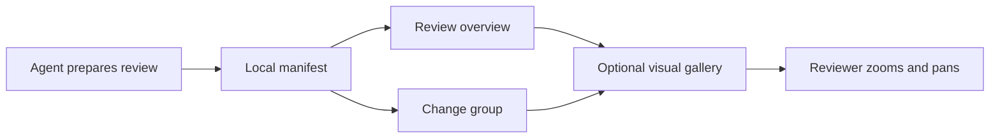

# Collections

A collection is a reading list: one or more reviews, each pointing at a worktree and the base to compare it with, and each diff split into change groups that explain it. Your agent usually writes it with the [`preread` skill](../skills/preread/SKILL.md), but it's plain JSON you can write yourself.

## Import and open

Run these from your Preread checkout. Import prints a link to the first review:

```sh
pnpm collection import /absolute/path/to/manifest.json
pnpm collection list
pnpm collection show <collection-id>
```

Open any review directly at `http://127.0.0.1:4780/?collection=<collection-id>&review=<review-id>`.

## Manifest

```json
{
  "id": "webhook-reliability",
  "title": "Webhook delivery reliability",
  "description": "Three changes planned for the next release. Read them in order.",
  "reviews": [
    {
      "id": "delivery-retries",
      "title": "Retry failed webhook deliveries",
      "description": "Failed deliveries now retry with exponential backoff instead of failing on the first error.",
      "path": "/Users/you/src/courier-retries",
      "base": "main",
      "mode": "branch",
      "pullRequest": "https://github.com/owner/repo/pull/142",
      "groups": [
        {
          "id": "backoff-policy",
          "title": "Backoff policy",
          "description": "A pure function decides when to try again. Check the jitter bounds and the 30-minute cap.",
          "targets": [{ "path": "src/delivery/backoff.ts" }, { "path": "test/backoff.test.ts" }]
        },
        {
          "id": "delivery-worker",
          "title": "Delivery worker",
          "description": "Records every attempt and schedules the next one.",
          "targets": [
            {
              "path": "src/delivery/worker.ts",
              "ranges": [{ "side": "new", "start": 40, "end": 52 }]
            }
          ]
        }
      ]
    }
  ]
}
```

| Field | Meaning |
| --- | --- |
| `id` | Lowercase letters, digits, and hyphens, up to 80 characters. Keep IDs stable, because review receipts are keyed by them. `other-changes` is reserved for group IDs. |
| `path` | Absolute path to the worktree or repository. |
| `base` | Any ref Git can resolve locally. `branch` and `all` compare against it. `working` and `staged` compare with HEAD and ignore it, but the field is still required, so use `""`. Preread never fetches, so make sure the ref has the commits you expect. |
| `mode` | `branch` compares the merge base of `base` and HEAD with HEAD. `all` adds staged, unstaged, and untracked changes. `working` compares HEAD with the working tree, including untracked files. `staged` compares HEAD with the index. |
| `pullRequest` | Optional GitHub pull request URL. |
| `targets[].path` | Exact, repository-relative file path. |
| `targets[].ranges` | Optional. One-based diff line numbers on the `new` side, or `old` for deleted lines. A range selects every complete hunk with a changed line inside it; hunks are never split. |

## How imports are checked

Import rejects unknown fields, empty groups, and paths that aren't repository-relative, so a typo fails instead of importing a group that shows nothing. It replaces a collection's configuration and keeps its review receipts. A receipt covers a group's title, description, targets, and diff, and its review's path, base, and mode; when any of them changes, the group shows Changed since review and needs another read.

Every changed hunk shows up somewhere: in the group that claims it, or under Other changes. A target that no longer matches the diff gets a warning, and so does a hunk claimed by two groups.

Editing a comparison in the UI opens an ad hoc view and leaves the saved review alone.

## Changes since Viewed

Click **Changed since review** on a group to compare each file with its most recent Viewed version. **Show full review** returns to the original comparison. Viewed and Mark all viewed save the represented file content in Preread’s local data directory without modifying the repository. Selected-block groups show a labeled whole-file comparison, including edits outside their selected blocks.

Older marks saved only hashes, so they cannot reconstruct a previous file version. Those files show a baseline-unavailable message until the next Viewed click. Binary, oversized and unsupported file types also show an explicit message. Only files still present in the current comparison appear.

## Large diffs and binary files

Text diffs with at least 500 displayed lines or 100 KB of patch text show **Load diff** instead of rendering automatically. Clicking loads that file’s full available diff; unchanged refreshes keep it open, and changed content requires another click. The same limit applies to comparisons since Viewed. The server’s separate 2 MB patch limit still applies.

Binary files such as fonts can be marked **Viewed** or included in **Mark all viewed** after local inspection. Their content fingerprints still invalidate the mark when the bytes change. Failed or unavailable oversized previews remain blocked.

## Visual context

Reviews and change groups support optional `visuals` arrays. Each item has a stable `id`, a descriptive `title`, an absolute local attachment `path`, and an optional `caption`. PNG, JPEG, WebP, GIF and SVG images up to 10 MB and Mermaid source files (`.mmd` or `.mermaid`) up to 64 KB are supported; each review or group can hold 12 visuals. For example, add this alongside a review’s `groups` or a group’s `targets`:

```json
"visuals": [{
  "id": "request-flow",
  "title": "How the request reaches the worker",
  "path": "/absolute/path/request-flow.svg",
  "caption": "The worker retries after the queue acknowledges the request."
}]
```

Import copies attachments into Preread’s own data directory and stores immutable content paths. Keep the original manifest paths when revising an attachment and reimport it to save a new version. Agents prepare titles, groups and visual context through manifests; the reading UI does not expose authoring controls.

A compact **Visuals** button shows the attachment count at review and group level. No image content loads until the gallery opens. The image canvas fills the full-screen viewer. Title, previous/next, close and zoom controls float over it instead of reserving vertical space; captions and usage instructions are not displayed. The thumbnail gallery starts hidden and opens from Browse visuals. Scroll or pinch to zoom, drag to move, or use Fit and 100% controls. The canvas also supports arrow keys to pan, +/− to zoom, Home or 0 to fit, and Escape to close; focus returns to the gallery button. Opening context does not change code Viewed marks or receipts.

Mermaid attachments use the same schema with a local source path. For example, `request-flow.mmd` may contain:



Mermaid is bundled locally and loaded only for an opened diagram, with strict rendering and plain-text labels. Configuration directives, front matter and external-resource URLs are unsupported. Generated SVG is displayed as an image, without interactive links or HTML. Imported SVG images are served sandboxed with external resources blocked.
